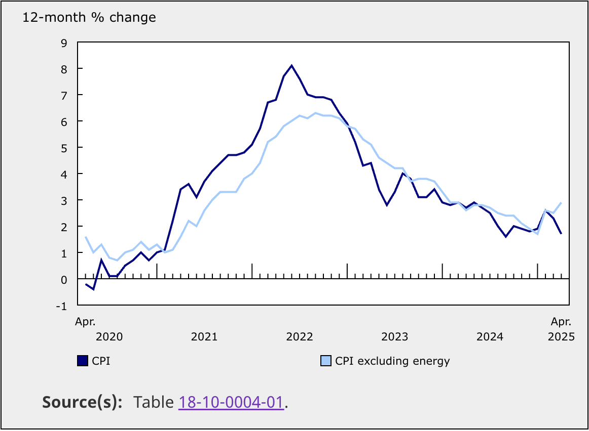

# Citing Sources from Statistics Canada

When you include a chart or table that uses Statistics Canada data, you should always provide the source directly below the figure for transparency and reproducibility.

## How to Cite Data from Statistics Canada

Suppose you include a chart like the one below, showing the 12-month percentage change in the Consumer Price Index (CPI) and CPI excluding energy from April 2020 to April 2025. 

The citation should include:
- The table number,
- A brief title or description (if space allows)
- And a clickable DOI link directly to the Statistics Canada dataset

Make the table name a clickable link to the original Statistics Canada dataset, and include the DOI if available.

The source should be formatted as:
>  **Source(s):** Table [table_name]

*For example (Best Practices):*

>  **Source(s):** [Table 20-10-0025-01, New motor vehicle registrations, quarterly, by geographic level](https://doi.org/10.25318/2010002501-eng)

Or, if space is tight, you can cite just the table number with the DOI link:
> **Source(s):** Table [18-10-0004-01](https://doi.org/10.25318/1810000401-eng)

Official Statistics Canada visuals often display only the table number as a clickable link under the chart, as shown in the example below. However, for internal or academic work, it is best practice to include both the table number and a brief title for added clarity.

  

## APA Citation Example for Statistics Canada Table

If you need to cite a Statistics Canada dataset in APA format (e.g., in a reference list or bibliography), use this format:

**APA 7th Edition Reference Example:**

> Statistics Canada. (Year). Title of table: Table number. (Version) [Data set]. https://doi.org/xx.xxxx/xxxxxxxxxxx

**Example:**

> Statistics Canada. (2024). New motor vehicle registrations, quarterly, by geographic level: Table 20-10-0025-01. [Data set]. https://doi.org/10.25318/2010002501-eng
